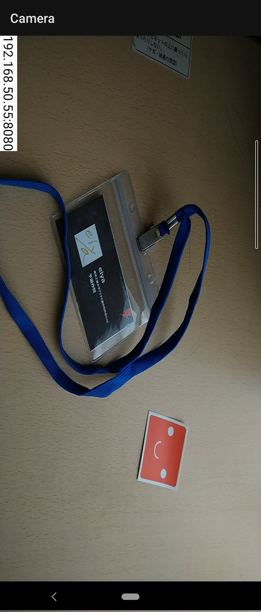

# CameraForPC

スマホのカメラ映像をリアルタイムにPCに転送する。 
(車輪の再発名だけど気にしない)

参考:  
https://github.com/ohwada/Android_Samples/tree/master/Camera219  
https://github.com/arktronic/cameraserve

## 嬉しさ

外付けカメラとは違い
* 新規にカメラを購入せずに使用できる

ノートPCの内臓カメラとは違い
* 角度が自由
* 位置が自由

## ユースケース

リモート会議で、手元にある立体的な物を配信したい。

しかし、
* 立体的な物であるので、写真を撮りプレゼン資料に張る手法では表現が難しい。
* プレゼン中に対話的に見せたいため、写真を撮った後PCに共有する手間を省きたい。
* 様々な角度から見せたいため、角度の自由が利かない内臓カメラでは不便。

という場合に有用。

## 基本技術

スマホ(Android)側
* camera2 APIにより、カメラ映像を取得
* スマホ画面に取得した映像を表示
* アプリをHTTPサーバーとして、通信を待ち受け
* 通信が来た場合、 `Content-Type: multipart/x-mixed-replace` として画像データを送り続ける

PC側
* Webブラウザを利用
* http通信によりAndroidにアクセスし、画像データを受け取って表示する

### 工夫

* スマホ側に現在のIPとポートを表示
* 軽量化のため画像を縮小して取得・送信
* カメラのオリジナルのアスペクト比でデータを送信

### 改善が必要な点

* レイテンシが大きいのを改善したい
  * 縮小処理に0.3秒ほどかかっている
* TCP通信ではなくUDP通信がしたい（要クライアント自作）
* データの暗号化をしたい
* スマホの回転に対応したい
* スマホのプレビューのアスペクト比と、実際の画像のアスペクト比が合っていないのをなおしたい
* 例外処理が雑なのをなおしたい

## スマホ側画面

